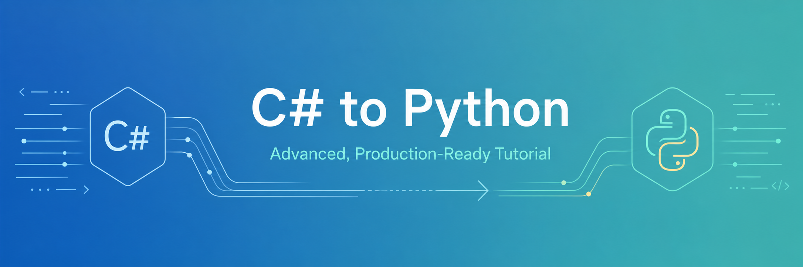

# C# to Python: Advanced, Production-Ready Tutorial - A 7 Day Challenge (Python 3.14.5 + uv)


<p align="center">
  
</p>

## Who This Repository Is For
This repository is for experienced C#/.NET developers who already understand OOP, generics, LINQ, async/await, dependency injection, build tools, and testing.

The goal is to help you become an advanced Python developer who can ship production-grade code confidently.

## One Week Study Plan
Use this sequence to build momentum without skipping fundamentals.

1. **Day 1: Foundations and runtime model**
   - Read: [Setup And Runtime](pages/advanced_walkthrough/README.md#01-setup-and-runtime), [Data And Flow](pages/advanced_walkthrough/README.md#02-data-and-flow)
   - Topics:
     - [1. Python project setup with uv](pages/advanced_walkthrough/01_setup_and_runtime/01_python_project_setup_with_uv.md)
     - [2. Python execution model](pages/advanced_walkthrough/01_setup_and_runtime/02_python_execution_model.md)
     - [3. Variables, names, references, and mutability](pages/advanced_walkthrough/02_data_and_flow/03_variables_names_references_and_mutability.md)
     - [4. Primitive types](pages/advanced_walkthrough/02_data_and_flow/04_primitive_types.md)
     - [5. Collections: list, tuple, dict, set, frozenset](pages/advanced_walkthrough/02_data_and_flow/05_collections_list_tuple_dict_set_frozenset.md)
     - [6. Slicing and unpacking](pages/advanced_walkthrough/02_data_and_flow/06_slicing_and_unpacking.md)
     - [7. Control flow](pages/advanced_walkthrough/02_data_and_flow/07_control_flow.md)

2. **Day 2: Functions and functional patterns**
   - Read: [Functions And Functional Tools](pages/advanced_walkthrough/README.md#03-functions-and-functional-tools)
   - Topics:
     - [8. Functions and Parameters](pages/advanced_walkthrough/03_functions_and_functional_tools/08_functions_and_parameters.md)
     - [9. Default arguments and keyword-only arguments](pages/advanced_walkthrough/03_functions_and_functional_tools/09_default_arguments_and_keyword_only_arguments.md)
     - [10. Lambdas](pages/advanced_walkthrough/03_functions_and_functional_tools/10_lambdas.md)
     - [11. Closures](pages/advanced_walkthrough/03_functions_and_functional_tools/11_closures.md)
     - [12. Decorators](pages/advanced_walkthrough/03_functions_and_functional_tools/12_decorators.md)
     - [13. Comprehensions](pages/advanced_walkthrough/03_functions_and_functional_tools/13_comprehensions.md)
     - [14. Iterators and generators](pages/advanced_walkthrough/03_functions_and_functional_tools/14_iterators_and_generators.md)
     - [15. Context managers](pages/advanced_walkthrough/03_functions_and_functional_tools/15_context_managers.md)

3. **Day 3: Errors, modules, and OOP modeling**
   - Read: [Errors And Modules](pages/advanced_walkthrough/README.md#04-errors-and-modules), [Oop And Modeling](pages/advanced_walkthrough/README.md#05-oop-and-modeling)
   - Topics:
     - [16. Exceptions](pages/advanced_walkthrough/04_errors_and_modules/16_exceptions.md)
     - [17. Modules and packages](pages/advanced_walkthrough/04_errors_and_modules/17_modules_and_packages.md)
     - [18. Imports and import system](pages/advanced_walkthrough/04_errors_and_modules/18_imports_and_import_system.md)
     - [19. Object-oriented programming](pages/advanced_walkthrough/05_oop_and_modeling/19_object_oriented_programming.md)
     - [20. Inheritance and composition](pages/advanced_walkthrough/05_oop_and_modeling/20_inheritance_and_composition.md)
     - [21. Properties](pages/advanced_walkthrough/05_oop_and_modeling/21_properties.md)
     - [22. Dataclasses](pages/advanced_walkthrough/05_oop_and_modeling/22_dataclasses.md)
     - [23. Enums](pages/advanced_walkthrough/05_oop_and_modeling/23_enums.md)
     - [25. Abstract base classes](pages/advanced_walkthrough/05_oop_and_modeling/25_abstract_base_classes.md)

4. **Day 4: Typing and advanced runtime model**
   - Read: [Typing And Protocols](pages/advanced_walkthrough/README.md#06-typing-and-protocols), [Advanced Language Runtime](pages/advanced_walkthrough/README.md#07-advanced-language-runtime)
   - Topics:
     - [24. Protocols and structural typing](pages/advanced_walkthrough/06_typing_and_protocols/24_protocols_and_structural_typing.md)
     - [26. Type hints](pages/advanced_walkthrough/06_typing_and_protocols/26_type_hints.md)
     - [27. Generics](pages/advanced_walkthrough/06_typing_and_protocols/27_generics.md)
     - [28. Pattern matching](pages/advanced_walkthrough/07_advanced_language_runtime/28_pattern_matching.md)
     - [29. Dunder methods and Python data model](pages/advanced_walkthrough/07_advanced_language_runtime/29_dunder_methods_and_python_data_model.md)
     - [30. Descriptors](pages/advanced_walkthrough/07_advanced_language_runtime/30_descriptors.md)
     - [31. Metaclasses](pages/advanced_walkthrough/07_advanced_language_runtime/31_metaclasses.md)

5. **Day 5: Concurrency and systems**
   - Read: [Concurrency And Systems](pages/advanced_walkthrough/README.md#08-concurrency-and-systems)
   - Topics:
     - [32. Async and await](pages/advanced_walkthrough/08_concurrency_and_systems/32_async_and_await.md)
     - [33. asyncio tasks, queues, cancellation, timeouts](pages/advanced_walkthrough/08_concurrency_and_systems/33_asyncio_tasks_queues_cancellation_timeouts.md)
     - [34. Threading](pages/advanced_walkthrough/08_concurrency_and_systems/34_threading.md)
     - [35. Multiprocessing](pages/advanced_walkthrough/08_concurrency_and_systems/35_multiprocessing.md)
     - [36. File I/O](pages/advanced_walkthrough/08_concurrency_and_systems/36_file_i_o.md)
     - [37. pathlib](pages/advanced_walkthrough/08_concurrency_and_systems/37_pathlib.md)
     - [38. JSON, CSV, TOML](pages/advanced_walkthrough/08_concurrency_and_systems/38_json_csv_toml.md)
     - [39. Logging](pages/advanced_walkthrough/08_concurrency_and_systems/39_logging.md)

6. **Day 6: Quality, packaging, and migration mindset**
   - Read: [Quality And Tooling](pages/advanced_walkthrough/README.md#09-quality-and-tooling), [Memory Idioms Migration](pages/advanced_walkthrough/README.md#10-memory-idioms-migration)
   - Topics:
     - [40. Testing with pytest](pages/advanced_walkthrough/09_quality_and_tooling/40_testing_with_pytest.md)
     - [41. Mocking](pages/advanced_walkthrough/09_quality_and_tooling/41_mocking.md)
     - [42. Debugging](pages/advanced_walkthrough/09_quality_and_tooling/42_debugging.md)
     - [43. Packaging](pages/advanced_walkthrough/09_quality_and_tooling/43_packaging.md)
     - [44. Dependency management](pages/advanced_walkthrough/09_quality_and_tooling/44_dependency_management.md)
     - [45. Virtual environments](pages/advanced_walkthrough/09_quality_and_tooling/45_virtual_environments.md)
     - [46. Linters and formatters](pages/advanced_walkthrough/09_quality_and_tooling/46_linters_and_formatters.md)
     - [47. Performance and profiling](pages/advanced_walkthrough/09_quality_and_tooling/47_performance_and_profiling.md)
     - [48. Memory management and garbage collection](pages/advanced_walkthrough/10_memory_idioms_migration/48_memory_management_and_garbage_collection.md)
     - [49. Standard library overview](pages/advanced_walkthrough/10_memory_idioms_migration/49_standard_library_overview.md)
     - [50. Python 3.14-specific features](pages/advanced_walkthrough/10_memory_idioms_migration/50_python_3_14_specific_features.md)
     - [51. Python idioms versus C# idioms](pages/advanced_walkthrough/10_memory_idioms_migration/51_python_idioms_versus_c_idioms.md)
     - [52. Common C# to Python migration mistakes](pages/advanced_walkthrough/10_memory_idioms_migration/52_common_c_to_python_migration_mistakes.md)

7. **Day 7: Additional language features, Python-only features, and capstone**
   - Read: [Additional Language Features](pages/advanced_walkthrough/README.md#11-additional-language-features), [Python-Only Features Index](pages/python_only_features/README.md)
   - Topics:
     - [53. Async iteration, async generators, and async context managers](pages/advanced_walkthrough/11_additional_language_features/53_async_iteration_async_generators_and_async_context_managers.md)
     - [54. Exception groups and `except*`](pages/advanced_walkthrough/11_additional_language_features/54_exception_groups_and_except.md)
     - [55. Assignment expressions (`:=`)](pages/advanced_walkthrough/11_additional_language_features/55_assignment_expressions.md)
     - [56. Binary data: `bytes`, `bytearray`, and `memoryview`](pages/advanced_walkthrough/11_additional_language_features/56_binary_data_bytes_bytearray_and_memoryview.md)
     - [57. Advanced typing: `ParamSpec`, `TypeVarTuple`, `Literal`, `Annotated`, `Self`](pages/advanced_walkthrough/11_additional_language_features/57_advanced_typing_paramspec_typevartuple_literal_annotated_self.md)
     - [58. `__slots__` as a language feature](pages/advanced_walkthrough/11_additional_language_features/58_slots_as_a_language_feature.md)
     - [59. Import hooks: custom finders and loaders](pages/advanced_walkthrough/11_additional_language_features/59_import_hooks_custom_finders_and_loaders.md)
     - [60. `contextvars` and task-local state](pages/advanced_walkthrough/11_additional_language_features/60_contextvars_and_task_local_state.md)
     - [61. Weak references and finalization patterns](pages/advanced_walkthrough/11_additional_language_features/61_weak_references_and_finalization_patterns.md)
     - [62. Advanced descriptor and metaclass patterns](pages/advanced_walkthrough/11_additional_language_features/62_advanced_descriptor_and_metaclass_patterns.md)
     - [Python-only feature 1: Duck Typing and Protocols](pages/python_only_features/feature_01_duck_typing_and_protocols.md)
     - [Python-only feature 2: Extended Unpacking](pages/python_only_features/feature_02_extended_unpacking.md)
     - [Python-only feature 3: Generator Pipelines](pages/python_only_features/feature_03_generator_pipelines.md)
     - [Python-only feature 4: Contextlib Context Managers](pages/python_only_features/feature_04_contextlib_magic.md)
     - [Python-only feature 5: Descriptors](pages/python_only_features/feature_05_descriptors.md)
     - [Python-only feature 6: Structural Pattern Matching](pages/python_only_features/feature_06_pattern_matching.md)
     - [Python-only feature 7: Metaclass Registry](pages/python_only_features/feature_07_metaclass_registry.md)
   - Build: [Capstone project](#capstone-project)

## Table of Contents
- [Who This Repository Is For](#who-this-repository-is-for)
- [Quick Start](#quick-start)
- [How To Use uv In This Project](#how-to-use-uv-in-this-project)
  - [`uv init`](#uv-init)
  - [`uv sync`](#uv-sync)
  - [`uv run`](#uv-run)
  - [`uv add`](#uv-add)
  - [Running Tests](#running-tests)
  - [Running Individual Examples](#running-individual-examples)
<!-- ADVANCED_WALKTHROUGH_TOPICS_START -->
- [Advanced Walkthrough for C# Developers](pages/advanced_walkthrough/README.md)
  - [01. Setup And Runtime](pages/advanced_walkthrough/README.md#01-setup-and-runtime)
    - [1. Python project setup with uv](pages/advanced_walkthrough/01_setup_and_runtime/01_python_project_setup_with_uv.md)
    - [2. Python execution model](pages/advanced_walkthrough/01_setup_and_runtime/02_python_execution_model.md)
  - [02. Data And Flow](pages/advanced_walkthrough/README.md#02-data-and-flow)
    - [3. Variables, names, references, and mutability](pages/advanced_walkthrough/02_data_and_flow/03_variables_names_references_and_mutability.md)
    - [4. Primitive types](pages/advanced_walkthrough/02_data_and_flow/04_primitive_types.md)
    - [5. Collections: list, tuple, dict, set, frozenset](pages/advanced_walkthrough/02_data_and_flow/05_collections_list_tuple_dict_set_frozenset.md)
    - [6. Slicing and unpacking](pages/advanced_walkthrough/02_data_and_flow/06_slicing_and_unpacking.md)
    - [7. Control flow](pages/advanced_walkthrough/02_data_and_flow/07_control_flow.md)
  - [03. Functions And Functional Tools](pages/advanced_walkthrough/README.md#03-functions-and-functional-tools)
    - [8. Functions and Parameters](pages/advanced_walkthrough/03_functions_and_functional_tools/08_functions_and_parameters.md)
    - [9. Default arguments and keyword-only arguments](pages/advanced_walkthrough/03_functions_and_functional_tools/09_default_arguments_and_keyword_only_arguments.md)
    - [10. Lambdas](pages/advanced_walkthrough/03_functions_and_functional_tools/10_lambdas.md)
    - [11. Closures](pages/advanced_walkthrough/03_functions_and_functional_tools/11_closures.md)
    - [12. Decorators](pages/advanced_walkthrough/03_functions_and_functional_tools/12_decorators.md)
    - [13. Comprehensions](pages/advanced_walkthrough/03_functions_and_functional_tools/13_comprehensions.md)
    - [14. Iterators and generators](pages/advanced_walkthrough/03_functions_and_functional_tools/14_iterators_and_generators.md)
    - [15. Context managers](pages/advanced_walkthrough/03_functions_and_functional_tools/15_context_managers.md)
  - [04. Errors And Modules](pages/advanced_walkthrough/README.md#04-errors-and-modules)
    - [16. Exceptions](pages/advanced_walkthrough/04_errors_and_modules/16_exceptions.md)
    - [17. Modules and packages](pages/advanced_walkthrough/04_errors_and_modules/17_modules_and_packages.md)
    - [18. Imports and import system](pages/advanced_walkthrough/04_errors_and_modules/18_imports_and_import_system.md)
  - [05. Oop And Modeling](pages/advanced_walkthrough/README.md#05-oop-and-modeling)
    - [19. Object-oriented programming](pages/advanced_walkthrough/05_oop_and_modeling/19_object_oriented_programming.md)
    - [20. Inheritance and composition](pages/advanced_walkthrough/05_oop_and_modeling/20_inheritance_and_composition.md)
    - [21. Properties](pages/advanced_walkthrough/05_oop_and_modeling/21_properties.md)
    - [22. Dataclasses](pages/advanced_walkthrough/05_oop_and_modeling/22_dataclasses.md)
    - [23. Enums](pages/advanced_walkthrough/05_oop_and_modeling/23_enums.md)
    - [25. Abstract base classes](pages/advanced_walkthrough/05_oop_and_modeling/25_abstract_base_classes.md)
  - [06. Typing And Protocols](pages/advanced_walkthrough/README.md#06-typing-and-protocols)
    - [24. Protocols and structural typing](pages/advanced_walkthrough/06_typing_and_protocols/24_protocols_and_structural_typing.md)
    - [26. Type hints](pages/advanced_walkthrough/06_typing_and_protocols/26_type_hints.md)
    - [27. Generics](pages/advanced_walkthrough/06_typing_and_protocols/27_generics.md)
  - [07. Advanced Language Runtime](pages/advanced_walkthrough/README.md#07-advanced-language-runtime)
    - [28. Pattern matching](pages/advanced_walkthrough/07_advanced_language_runtime/28_pattern_matching.md)
    - [29. Dunder methods and Python data model](pages/advanced_walkthrough/07_advanced_language_runtime/29_dunder_methods_and_python_data_model.md)
    - [30. Descriptors](pages/advanced_walkthrough/07_advanced_language_runtime/30_descriptors.md)
    - [31. Metaclasses](pages/advanced_walkthrough/07_advanced_language_runtime/31_metaclasses.md)
  - [08. Concurrency And Systems](pages/advanced_walkthrough/README.md#08-concurrency-and-systems)
    - [32. Async and await](pages/advanced_walkthrough/08_concurrency_and_systems/32_async_and_await.md)
    - [33. asyncio tasks, queues, cancellation, timeouts](pages/advanced_walkthrough/08_concurrency_and_systems/33_asyncio_tasks_queues_cancellation_timeouts.md)
    - [34. Threading](pages/advanced_walkthrough/08_concurrency_and_systems/34_threading.md)
    - [35. Multiprocessing](pages/advanced_walkthrough/08_concurrency_and_systems/35_multiprocessing.md)
    - [36. File I/O](pages/advanced_walkthrough/08_concurrency_and_systems/36_file_i_o.md)
    - [37. pathlib](pages/advanced_walkthrough/08_concurrency_and_systems/37_pathlib.md)
    - [38. JSON, CSV, TOML](pages/advanced_walkthrough/08_concurrency_and_systems/38_json_csv_toml.md)
    - [39. Logging](pages/advanced_walkthrough/08_concurrency_and_systems/39_logging.md)
  - [09. Quality And Tooling](pages/advanced_walkthrough/README.md#09-quality-and-tooling)
    - [40. Testing with pytest](pages/advanced_walkthrough/09_quality_and_tooling/40_testing_with_pytest.md)
    - [41. Mocking](pages/advanced_walkthrough/09_quality_and_tooling/41_mocking.md)
    - [42. Debugging](pages/advanced_walkthrough/09_quality_and_tooling/42_debugging.md)
    - [43. Packaging](pages/advanced_walkthrough/09_quality_and_tooling/43_packaging.md)
    - [44. Dependency management](pages/advanced_walkthrough/09_quality_and_tooling/44_dependency_management.md)
    - [45. Virtual environments](pages/advanced_walkthrough/09_quality_and_tooling/45_virtual_environments.md)
    - [46. Linters and formatters](pages/advanced_walkthrough/09_quality_and_tooling/46_linters_and_formatters.md)
    - [47. Performance and profiling](pages/advanced_walkthrough/09_quality_and_tooling/47_performance_and_profiling.md)
  - [10. Memory Idioms Migration](pages/advanced_walkthrough/README.md#10-memory-idioms-migration)
    - [48. Memory management and garbage collection](pages/advanced_walkthrough/10_memory_idioms_migration/48_memory_management_and_garbage_collection.md)
    - [49. Standard library overview](pages/advanced_walkthrough/10_memory_idioms_migration/49_standard_library_overview.md)
    - [50. Python 3.14-specific features](pages/advanced_walkthrough/10_memory_idioms_migration/50_python_3_14_specific_features.md)
    - [51. Python idioms versus C# idioms](pages/advanced_walkthrough/10_memory_idioms_migration/51_python_idioms_versus_c_idioms.md)
    - [52. Common C# to Python migration mistakes](pages/advanced_walkthrough/10_memory_idioms_migration/52_common_c_to_python_migration_mistakes.md)
  - [11. Additional Language Features](pages/advanced_walkthrough/README.md#11-additional-language-features)
    - [53. Async iteration, async generators, and async context managers](pages/advanced_walkthrough/11_additional_language_features/53_async_iteration_async_generators_and_async_context_managers.md)
    - [54. Exception groups and `except*`](pages/advanced_walkthrough/11_additional_language_features/54_exception_groups_and_except.md)
    - [55. Assignment expressions (`:=`)](pages/advanced_walkthrough/11_additional_language_features/55_assignment_expressions.md)
    - [56. Binary data: `bytes`, `bytearray`, and `memoryview`](pages/advanced_walkthrough/11_additional_language_features/56_binary_data_bytes_bytearray_and_memoryview.md)
    - [57. Advanced typing: `ParamSpec`, `TypeVarTuple`, `Literal`, `Annotated`, `Self`](pages/advanced_walkthrough/11_additional_language_features/57_advanced_typing_paramspec_typevartuple_literal_annotated_self.md)
    - [58. `__slots__` as a language feature](pages/advanced_walkthrough/11_additional_language_features/58_slots_as_a_language_feature.md)
    - [59. Import hooks: custom finders and loaders](pages/advanced_walkthrough/11_additional_language_features/59_import_hooks_custom_finders_and_loaders.md)
    - [60. `contextvars` and task-local state](pages/advanced_walkthrough/11_additional_language_features/60_contextvars_and_task_local_state.md)
    - [61. Weak references and finalization patterns](pages/advanced_walkthrough/11_additional_language_features/61_weak_references_and_finalization_patterns.md)
    - [62. Advanced descriptor and metaclass patterns](pages/advanced_walkthrough/11_additional_language_features/62_advanced_descriptor_and_metaclass_patterns.md)
<!-- ADVANCED_WALKTHROUGH_TOPICS_END -->
<!-- PYTHON_ONLY_FEATURES_TOPICS_START -->
- [Python-Only Features](pages/python_only_features/README.md)
  - [1. Duck Typing and Protocols](pages/python_only_features/feature_01_duck_typing_and_protocols.md)
  - [2. Extended Unpacking](pages/python_only_features/feature_02_extended_unpacking.md)
  - [3. Generator Pipelines](pages/python_only_features/feature_03_generator_pipelines.md)
  - [4. Contextlib Context Managers](pages/python_only_features/feature_04_contextlib_magic.md)
  - [5. Descriptors](pages/python_only_features/feature_05_descriptors.md)
  - [6. Structural Pattern Matching](pages/python_only_features/feature_06_pattern_matching.md)
  - [7. Metaclass Registry](pages/python_only_features/feature_07_metaclass_registry.md)
<!-- PYTHON_ONLY_FEATURES_TOPICS_END -->
- [C# Features With No Direct Python Equivalent](#c-features-with-no-direct-python-equivalent)
- [Python Features With No Direct C# Equivalent](#python-features-with-no-direct-c-equivalent)
- [One Week Study Plan](#one-week-study-plan)
- [Capstone Project](#capstone-project)
- [Further Study](#further-study)


## Quick Start
```bash
uv sync
uv run src/csharp_to_python_learning/concepts/01_setup_and_runtime/topic_01_python_project_setup_with_uv.py
uv run -m pytest
```

## How To Use uv In This Project
### `uv init`
Initialize a new project (already done in this repository):
```bash
uv init --package --python 3.14.5
```

### `uv sync`
Create/update `.venv` and install dependencies from `pyproject.toml` + `uv.lock`:
```bash
uv sync
```

### `uv run`
Run a command inside the project environment:
```bash
uv run -m pytest
uv run src/csharp_to_python_learning/concepts/03_functions_and_functional_tools/topic_12_decorators.py
```

### `uv add`
Add a runtime dependency:
```bash
uv add httpx
```
Add a dev dependency:
```bash
uv add --dev pytest ruff mypy
```

### Running Tests
```bash
uv run -m pytest
uv run -m pytest tests/test_concept_smoke.py -k asyncio
```

### Running Individual Examples
Every concept is runnable directly:
```bash
uv run src/csharp_to_python_learning/concepts/10_memory_idioms_migration/topic_50_python_3_14_specific_features.py
```

<!-- ADVANCED_WALKTHROUGH_START -->
## Advanced Walkthrough for C# Developers
The full concept-by-concept walkthrough is available in the pages folder:
- [Advanced Walkthrough Index](pages/advanced_walkthrough/README.md)

<!-- ADVANCED_WALKTHROUGH_END -->

## Python-Only Features
Python-only features are organized in dedicated pages, similar to the Advanced Walkthrough:
- [Python-Only Features Index](pages/python_only_features/README.md)

## C# Features With No Direct Python Equivalent
- Reified generics at runtime with CLR metadata behavior.
- Method overloading resolution by compile-time signature.
- `ref`, `out`, and unsafe pointer patterns as first-class language features.
- Attribute-driven compile-time/source-generator ecosystems.
- Value types (`struct`) with stack semantics equivalent to .NET.

## Python Features With No Direct C# Equivalent
- Runtime monkey-patching of modules/classes/functions.
- Descriptors as first-class attribute access primitives.
- Structural pattern matching with heterogeneous shape patterns.
- Context manager protocol (`with`) as a language-level resource hook.
- Rich dunder protocol for integrating with core syntax at runtime.
- Metaclass-driven class construction customization.
- Extended iterable unpacking in assignments and function calls.

## Capstone Project
Run the capstone:
```bash
uv run src/csharp_to_python_learning/capstone/capstone_async_event_pipeline.py
```
Capstone combines:
- dataclasses
- protocols/typing
- asyncio queues/tasks
- transformation pipeline patterns
- logging
- deterministic summary output

## Further Study
- Official Python docs for 3.14 language/runtime updates.
- `asyncio` internals and cancellation design patterns.
- Advanced typing (`TypeVarTuple`, `ParamSpec`, plugin/tooling ecosystems).
- Packaging and release automation for internal Python platforms.


